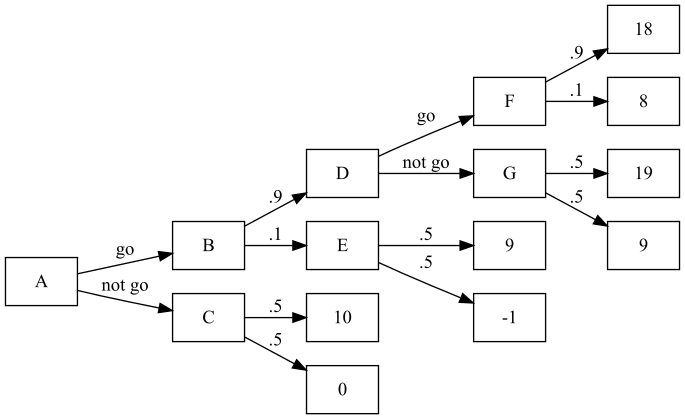

\thispagestyle{empty}
\begin{center}
\Large{ORIE 4350 Course Notes}

\large{Ben Goldstein (brg54), Ben Rosenberg (bar94)}

\large{\today}
\end{center}

\vspace{0.25in}


# I. Assumptions, rationality, risk-aversion, and types of games

A **decision** has three features: 

 - **Actions** an agent can choose,
 - Possible consequences of these actions (**outcomes**), and
 - **preference relations** between these outcomes, e.g. $x_1 \succ x_2$ for strong preference and $x_1 \succeq x_2$ for weak preference.

A **payoff function** quantifies the utility from an outcome (so if $v(x_1) \geq v(x_2)$, then $x_1$ has $\geq$ payoff function value, and $x_1 \succ x_2$)

By assumptions of **transitivity** (if $v(x_1) > v(x_2)$ and $v(x_2) > v(x_3)$, then $v(x_1) > v(x_3)$ -- see *Condorcet paradox*) and **completeness** (for any outcome $x_n$ in $x$, either $x_1 \succ x_2$, $x_2 \succeq x_1$, or both)

> $\rightarrow$ **Proposition 1.1**: If a set of outcomes $x$ is finite, then any rational preference relation over $x$ can be represented by a payoff function.

> $\rightarrow$ **Definition 1.2**: An agent faced with a decision problem is **rational** if the agent chooses $a^*$ such that $v(x(a^*)) \geq v(x(a))$ for all possible choices of $a$; or, in other words, if this agent *maximizes the payoff function*.

Games can be displayed in such forms as functions, matrices, and decision trees:

## 1. Cournot Duopoly: Games as functions

The Cournot Duopoly is defined as follows, in **normal form**:

 - $N = \{1,2\}$ (2 players)
 - $S_i = [0, \infty)$ (possible strategies give $0$ to $\infty$)
 - $v_i(s_i, s_j) = (100 - s_i - s_j) \cdot s_i - s_i^2$ (payoff function given strategies $s_i$ and $s_j$)

To maximize $v_i$, we can first rewrite it as $100 s_i - 2s_i^2 - s_i\cdot s_j$. Then, taking the derivative and setting it equal to $0$:
$$\frac{\partial v_i}{\partial s_i} = 100 - 4s_i - s_j = 0$$

Rearranging to get $s_i$, we have $$s_i = \frac{100 - s_j}{4}.$$ If we plug in the minimum value for $s_j$, we can get an upper bound on the value of $s_i$: $$\frac{100 - 0}{4} = 25$$ Since $s_i$ is bounded above at $25$, we can repeat this from the angle of $s_j$ as follows: $$\frac{100 - 25}{4} = 18.75$$ ...giving us a lower bound on the value of $s_j$. We can make a simple program to do this in Python, stopping when we either iterate more than 1000 times or we are within $\frac{1}{10000}$ of the value we had at the previous iteration:

```python
x = 0; prev_x = -float('inf')
iters = 0
while abs(x - prev_x) > 1e-4 and iters < 1000:
    prev_x = x
    x = (100 - x)/4
    iters += 1
print(round(x,2))
```

```
=> 20.0
```

Alternatively, this problem happens to be solvable using the second derivative (as the interval does indeed converge to a single value) as follows:
$$\frac{\partial v_i}{\partial s_i^2} = - 4$$

Since $-4 < 0$, we know that $v_i$ is concave down. Therefore, there must be one point which maximizes the function, which we can solve for using a system of equations, along with the use of symmetry and first-derivative optimization:
$$\begin{aligned}
    100 - 4s_i -s_j &= 0 \\
    100 - 4s_i &= s_j \\
    100 - 4(100 - 4s_j) &= s_j \\
    100 - 400 + 16s_j &= s_j \\
    -300 &= -15s_j\\
    s_i = s_j &= 20
\end{aligned}$$

Note that taking the second derivative and solving a system of equations is not guaranteed to yield the correct answer, as it does not work for ranges of answers. It is, however, a useful tool to check one's work.

## 2. R\&D Problem: Games as decision trees

Example decision tree game:

 - $N = \{1\}$ (this is more of a decision than a game)
 - $S_i = \{\text{go}, \text{don't go}\}$
 - $v_i$ depends on successes and failures, and is defined using the following tree:



We use *expected values* and **backwards induction** to find the optimal choice of $[A, G]$:
$$\begin{aligned}
    F &= 18(.9) + 8(.1) = 17 \\
    G &= 19(.5) + 9(.5) = 14 \\
    D &= \max(F,G) = \max(17,14) = 17 \quad \text{by rationality} \\
    E &= 9(.5) + -1(.5) = 4 \\
    B &= D(.9) + E(.1) = 17(.9) + 4(.1) = 15.7 \\
    C &= 10(.5) = 5 \\
    \text{(expected payoff)}\quad A &= 15.7, \quad \text{found by \textit{going}}
\end{aligned}$$

Note that if going increased $P(\text{success})$ to $.6$ instead of $.9$, it would probably be best *not* to go. 

**Risk-neutral** implies that $v(x) = x$; this may not be the case in real life, where a downside generally hurts more than an upside helps. 

To show that most people are **risk-averse** rather than risk-neutral, consider the following scenario: A person can accept \$1000, or they can flip some number of coins given by sequence $c$ with the following rewards: 
$$\text{reward}(c) = \begin{cases} \$1 & c = [t] \\
                                \$2 & c = [h;t] \\
                                \$4 & c = [h;h;t] \\
                                \vdots & \vdots \\
                                \$\infty & c = [\underbrace{h; \dots}_{\infty \text{ times}};t]
\end{cases}$$

The expected value of the above reward is, where $h_c$ is the number of $h$ flips in sequence $c$: $$\sum_{h_c=0}^\infty 2^{h_c} \left(\frac{1}{2}\right)^{h_c} = \$\infty$$

However, few people would take the coin flips: people are risk-averse.

## 3. The Prisoner's Dilemma: Games as matrices

The Prisoner's Dilemma problem is defined as follows:

 - $N = \{1,2\}$
 - $S_i = \{C := \text{confess}, S := \text{stay silent}\}$
 - $v_i(s_i, s_j)$ is symmetric with the following payoffs:
   - $v_i(C,C) = -4$
   - $v_i(C,S) = -1$
   - $v_i(S,C) = -5$
   - $v_i(S,S) = -2$

This can be written as a matrix like so:
$$\begin{array}{r||c|c}
    P1 \backslash P2& C & S \\
    \hline \hline
    C & (-4,-4) & (-1,-5) \\
    \hline
    S & (-5,-1) & (-2,-2)
\end{array}$$

What should a player do in this scenario? *Strategies* will tell us.

# II. Strategies for pure games: IESDS, Rationalizability, and Nash Equilibrium

A **static game with complete information** is a game, like above, where every player chooses an action simultaenously and independently, and all players know all possible actions of all players, all possible outcomes, the outcomes that result from the given actions, and the payoffs of all players. **Pure strategies** are deterministic plans of actions a player takes in every "situation of the game".

We say that strategy $A$ is **strictly dominated** by strategy $B$ if the payoff of strategy $B$ beats the payoff of strategy $A$ in all situations. For example, in the Prisoner's Dilemma example above, since $-4 > -5$ and $-1 > -2$, $P2$'s action $C$ strictly dominates $S$. The same is true for $P1$ by symmetry, so the **strictly dominant** strategy that remains is $[C,C]$. 

> $\rightarrow$ By **Claim 4.1**, a player that is rational will never play a strictly dominated strategy.

> Thus, the only rational choice for each player is to choose $C$.

## Strategy 1: IESDS

The self-explaining **IESDS** (Iterated Elimination of Strictly Dominated Strategies) method eliminates strictly dominated strategies. 

### Example (A): $3\times 3$ matrix

Consider the following game, given in normal form with payoff matrix below:

 - $N = \{1,2\}$
 - $S_1 = \{U,M,D\}$
 - $S_2 = \{L,C,R\}$

$$\begin{array}{r||c|c|c}
    P1 \backslash P2& L & C & R \\
    \hline \hline
    U & (4,3) & (5,1) & (6,2) \\
    \hline
    M & (2,1) & (8,4) & (3,6) \\
    \hline
    D & (3,0) & (9,6) & (2,8)
\end{array}$$

We use IESDS as follows:

 - **For $P2$**: $2 > 1$, $6 > 4$, and $8 > 6$, so $C$ is strictly dominated by $R$
 - **For $P1$**: $4 > 2$ and $4 > 3$, and $6 > 3$ and $6 > 2$; therefore, $M$ and $D$ are strictly dominated by $U$
 - **For $P2$**: $3 > 2$, so $R$ is strictly dominated by $L$. 

Therefore, $[U,L]$ is the solution by IESDS.

### Example (B): Cournot Duopoly

See above: I $\rightarrow$ 1. Cournot Duopoly. The convergence method is really an example of IESDS.

### Example (C): Second-price auction

Strong dominance is not the only means of selecting a strategy. Consider a **second-price auction**, wherein players bid and the player with the highest bid only pays the amount of the second-highest bid. A small example, with only 2 players, could be defined as follows:

 - Player $P1$, who values the item at price $v_1$, bids $b_1$
 - Player $P2$, who values the item at price $v_2$, bids $b_2$
 - The profit for player $i$ is $v_i - b_{i+1\text{ mod } 2}$ if player $i$ wins, and $0$ otherwise.

We then have the following cases for $P1$:
$$\text{profit} = \begin{cases} 
    \begin{cases}
        0 & v_1 = b_2 \\
        - & v_1 < b_2 \\
        + & v_1 > b_2 
    \end{cases} & b_1 > b_2 \\
    0 & b_1 < b_2
\end{cases}$$

So, $P1$ only loses when $v_1 < b_2 < b_1$, which cannot happen if $b1 = v1$. Therefore, $b_1 = v_1$ is **weakly dominant**: that is, there is at least one scenario in which it is equal to other strategies, but there is also at least one scenario in which it dominates other strategies. Since the strategy is weakly dominant, it is also a **best response**.

## Strategy 2: Best responses and rationalizability

A **best response** is, given all opponent strategies, the best strategy a player can play. In other words:
$$BR_i = s_i^* \iff v_i (s_i^*, s_{-i}) \geq v_i(s_i, s_{-i}) \quad \forall s_i \in S_i.$$

If we look at the $3\times 3$ matrix example from the previous part, we see that:

 - $BR_1(L) = U$, $BR_1(C) = D$, and $BR_1(R) = U$
   - Therefore, it is never in the best interest of player $P1$ to play $M$
 - $BR_2(U) = L$, $BR_2(M) = R$, and $BR_2(D) = R$
   - Therefore, it is never in the best interest of player $P2$ to play $C$

Repeating with those choices taken out gives:

 - $BR_1(L) = U$ and $BR_1(R) = U$
   - Therefore, it is never in the best interest of player $P1$ to play $D$
 - $BR_2(U) = L$ and $BR_2(D) = R$

So, since $BR_1(L) = U$ and $BR_2(U) = L$, we know that $[U,L]$ is the **rationalizable equilibrium**.

> **Proposition 4.3**: A strictly dominated strategy *cannot* be a best response, beacuse if $v_i(s_i^*, s_{-i}) < v_i(s_i, s_{-i})$ for some $s_i$, then $v_i(s_i^*, s_{-i}) \not\geq v_i(s_i, s_{-i})$ for that $s_i$.

### Example: IESDS equilibria vs. rationalizable equilibria

However, the set of rationalizable equilibria is a *subset* of IESDS equilibria. Consider the following game:

$$\begin{array}{r||c|c}
    P1 \backslash P2& L & R \\
    \hline \hline
    U & (3,0) & (0,0) \\
    \hline
    M & (0,0) & (3,0) \\
    \hline
    D & (1,0) & (1,0)
\end{array}$$

According to IESDS, there are no strongly dominated strategies. Therefore, all 6 of the possible strategies survive IESDS:
$$\text{IESDS} \implies \{[L,U], [R,U], [L,M], [R,M], [L,D], [R,D]\}$$

We can, however, pare down the strategies using best responses as follows:

 - $BR_1(L) = U$ and $BR_1(R) = M$, so $P1$ will never play $D$
 - $BR_2(U) = BR_2(M) = BR_2(D) = \{L, R\}$. We can't really say anything about $P2$.

With this alone we reduce the size of our outcome set by $\frac{1}{3}$:
$$\text{BR} \implies \{[L, U], [R, U], [L,M], [R,M]\}$$

## Strategy 3: Nash equilibria

A **Nash equilibrium** of $[A, B]$ between players $i$ and $j$ holds when $BR_i(A) = B$ and $BR_j(B) = A$, or more formally:
$$s_i^* \in BR_i (s_{-i}^*) \quad \forall i.$$

In the above example, $BR_1(L) = U$, $BR_2(U) = L$, $BR_1(R) = M$, and $BR_2(M) = R$, so the set of Nash equilibria is $\{[L,U], [R,M]\}$.

> **Proposition 5.1**: If a strategy profile is a strictly dominant strategy equilibrium, a unique IESDS survivor, or a unique rationalizable strategy profile, it is a Nash equilibrium.

Unfortunately, rational actors' collective selfishness ends up detracting from the greater good. This is called the **Tragedy of the Commons**.

For example, if there are $K$ units of clean air, each firm $i$ uses $k_i$ units, and payoffs $v_i(k_i, k_{-i})$ are $$v_i(k_i, k_{-i}) = \ln(k_i) + \ln\left(K - \sum_{j} k_j\right),$$

then we have the following:
$$BR_i(k_i) = \text{argmax}_{k_i} \left[\ln\left(K - \sum_{j} k_j\right)\right]$$
$$\begin{aligned}
    \frac{\partial v_i(k_i, k_{-i})}{\partial k_i} &= \frac{1}{k_i} + \frac{1}{K - \sum_{j} k_j}(-1) = 0 \\
    \frac{1}{k_i} &= \frac{1}{K - \sum_{j} k_j} \\
    k_i &= K - \sum_{j} k_j \\
    &= K - \left[\left(\sum_{j\neq i} k_j\right) + k_i\right] \\
    2k_i &= K - \sum_{j\neq i} k_j \\
    k_i &= \frac{1}{2} \left(\sum_{j\neq i} k_j\right)
\end{aligned}$$

If there are $2$ firms, then $k_1 = k_2 = \frac{1}{3} K$ at the Nash equilibrium.

A government, on the other hand, would maximize total welfare:
$$w := \ln(k_1) + \ln(K - k_1 - k_2) + \ln(k_2) + \ln(K - k_2 - k_1)$$
$$\frac{\partial w}{\partial k_1} = \frac{1}{k_1} - \frac{2}{K - k_1 - k_2}$$

By symmetry, setting $\frac{\partial w}{\partial k_1} = 0$ reveals $k_1 = k_2 = \frac{1}{4}K$ at the government optimum. Thus, the Nash equilibrium of a game is not necessarily the best for total welfare.

# III. Mixed strategies

Some games have no pure strategy Nash equilibrium. In Rock-Paper-Scissors, for instance:

 - $BR(\text{Rock}) = \text{Paper}$$
 - $BR(\text{Paper}) = \text{Scissors}$$
 - $BR(\text{Scissors}) = \text{Rock}$$

(Note that the above relationships and the symmetry of the above game imply that the game is not transitive.)

If $S_i = \{s_1, \dots, s_n\}$ is the **pure strategy** set for player $i$, we define **mixed strategies** to be of the form "$s_{ik}$ played with probability $\sigma_i(s_{ik})$", or in the case of Rock-Paper-Scissors:
$$\sigma_1(R) = \frac{1}{3} \quad \sigma_1(P) = \frac{1}{3} \quad \sigma_1(S) = \frac{1}{3}$$

Note that $\sum_k s_{ik} = 1$. In pure strategies, $\sigma_i(s_i) = 1$ for any $s$.

## Definitions regarding mixed strategies

> $\rightarrow$ **Definition 6.3**: Over interval $S_i$, a **mixed strategy** for player $i$ is a CDF (cumulative distribution function) $F_i : S_i \rightarrow [0,1]$ where a player plays $s_i \leq x$ with probability $\Pr(s_i\leq x) = F_i(x)$. If $F_i(\cdot)$ is differentiable with density $f_i(\cdot)$, then we say that $s_i\in S_i$ is **in the support** of $F_i(\cdot)$ if $f_i(s_i) > 0$; or in other words, $s_i$'s rationality as a strategy is vouched for by $F_i$ if $f_i(s_i) > 0$.

> $\rightarrow$ **Definition 6.4**: A **belief** of player $i$ is a probability distribution $\pi_i\in \Delta S_{-i}$ over the strategies of his opponents. We denote the probability player $i$ assigns to his opponents playing $s_{-i} \in S_{-i}$ as $\pi_i(s_{-i})$.

> $\rightarrow$ **Definition 6.5**: The **expected payoff** of player $i$ when he chooses *pure strategy* $s_i\in S_i$ and all other players play mixed strategies $\sigma_{-i}\in \Delta S_{-i}$ is as follows:
$$v_i(s_i, \sigma_{-i}) = \sum_{s_{-i}\in S_{-i}} \sigma_{-i} (s_{-i}) v_i (s_i, s_{-i}).$$

> Similarly, the expected payoff of player $i$ when he chooses *mixed strategy* $\sigma_i\in \Delta S_i$ and all other players play mixed strategies $\sigma_{-i}\in \Delta S_{-i}$ is as follows:
$$\begin{aligned} 
    v_i(\sigma_i, \sigma_{-i}) &= \sum_{s_{i}\in S_{i}} \sigma_{i} (s_{i}) v_i (s_i, \sigma_{-i}) \\
    &= \sum_{s_i\in S_i} \left(\sum_{s_{-i}\in S_{-i}} \sigma_{-i} (s_{-i}) v_i (s_i, s_{-i})\right)
\end{aligned}$$

## Example (A): Rock-Paper-Scissors

For example, in Rock-Paper-Scissors, if player $2$ plays the following $\sigma_2$...
$$\sigma_2(R) = \sigma_2(P) = \frac{1}{2}, \sigma_2(S) = 0$$

...then we get the following payoffs for player $1$:

 - $v_1(R, \sigma_2) = \frac{1}{2} (-1) + \frac{1}{2} (0) = -\frac{1}{2}$
 - $v_1(P, \sigma_2) = \frac{1}{2} (0) + \frac{1}{2} (1) = \frac{1}{2}$
 - $v_1(S, \sigma_2) = \frac{1}{2} (1) + \frac{1}{2} (-1) = 0$

Thus, the best response is $\{P\}$. This makes intuitive sense given that no matter what, $P$ can never be beaten by player $2$ because they never play $S$.

## Example (B): Nickel-Dime game

We define the Nickel-Dime game as follows:

$$\begin{array}{r||c|c}
    P1 \backslash P2& N & D \\
    \hline \hline
    N & (5,-5) & (-5,10) \\
    \hline
    D & (-10,5) & (10,-10) 
\end{array}$$

In calculating the Nash equilibrium for the above game, assume that $P2$ plays $\sigma_2$, and that $p = \Pr(\text{Nickel})$ and that $1-p = \Pr(\text{dime})$.

We calculate the Nash equilibria using best-responses as follows:

 - $BR_1(N, \sigma_2) = 5p + -10(1-p) = 15p-10$
 - $BR_1(D,\sigma_2) = -5p + 10(1-p) = -15p+10$

The best choice for $P1$ depends on $p$, and can be calculated as follows:
$$\begin{aligned}
    15p - 10 &> -15p + 10 \\
    -20 &> -30p \\
    2 &< 3p \\
    \frac{2}{3} &< p
\end{aligned}$$

Thus, if $p > \frac{2}{3}$, then $BR_1$ is $N$.

And assuming the opposite for player $P1$:

 - $BR_2(N,\sigma_1) = -5q + 10(1-q) = -15q+10$
 - $BR_2(D, \sigma_1) = 5q + -10(1-q) = 15q-10$

And with similar calculations:
$$\begin{aligned}
    -15p - 10 &> 15p + 10 \\
    -30q &> -20 \\
    3q &< 2 \\
    q &< \frac{2}{3}
\end{aligned}$$

So if $q < \frac{2}{3}$, then $BR_2$ is $N$ as well.

It turns out that if $p = q  = \frac{2}{3}$, then the players are indifferent about their choice between $N$ and $D$. 

For either player:
$$P1: BR_1((p, 1-p)) = \begin{cases} N & p > \frac{2}{3} \\ D & p < \frac{2}{3} \\ \{N,D\} & p = \frac{2}{3} \end{cases}$$
$$P2: BR_2((q, 1-q)) = \begin{cases} N & q < \frac{2}{3} \\ D & q > \frac{2}{3} \\ \{N,D\} & q = \frac{2}{3} \end{cases}$$

In the last of the three cases for each of these, any mixed combination of $N$ or $D$ has equal expectation.

Note that the Nash equilibrium here is (in the form $(N,D)$): 
$$\left[\left(\frac{2}{3}, \frac{1}{3}\right), \left(\frac{1}{3}, \frac{2}{3}\right)\right]$$

By **Proposition 6.1**, if $\sigma^* = (\sigma_1^*, \sigma_2^*, \dots, \sigma_n^*)$ is a Nash equilibrium, and player $P1$ has pure strategies $s_i$ and $s_i'$ as well as mixed strategy $\sigma_i^*$ which is a combination of $s_i$ and $s_i'$, then $v_i$ is as follows:
$$v_i(s_i, \sigma_{-i}^*) = v_i(s_i^*, \sigma_{-i}^*) = v_i(\sigma_i, \sigma_{-i}).$$

If this were *not* the case -- say, $v_i(s_i, \sigma_{-i}^*) < v_i(s_i', \sigma_{-i}^*)$ -- then it would *never* be better to play $s_i'$ over $s_i$. If a player is randomizing between two strategies, *the player must be indifferent between them*. The reason for playing a mixed strategy is so that another player cannot intuit the original player's strategy.

## Example (C): $2\times 2$ matrix

Consider the following example: 
$$\begin{array}{r||c|c}
    P1 \backslash P2& C & R \\
    \hline \hline
    M & (0,0) & (3,5) \\
    \hline
    D & (4,4) & (0,3) 
\end{array}$$

By *pure strategy*:

 - $BR_1(C) = D$, $BR_1(R) = M$
 - $BR_2(M) = R$, $BR_2(D) = C$

So  $[C,D]$ and $[M,R]$ are *pure* equilibria.

For a *mixed* strategy:

 - $v_1(M, \sigma_2^*) = \sigma_2^*(C) v_1(M,C) + \sigma_2^*(R) v_1(M,R)$
 - $v_1(D, \sigma_2^*) = \sigma_2^*(C) v_1(D,C) + \sigma_2^*(R) v_1(D,R)$

 - $v_1(M,\sigma_2^*) = 3\sigma_2^*(R) = 2(1-\sigma_2^*(C)) = 3 - 3\sigma_2^*(C)$
 - $v_1(M,\sigma_2^*) = 4\sigma_2^*$

So:
$$\begin{aligned}
    3 - 3\sigma_2^*(C) &> 4\sigma_2^* \\
    3 &> 7\sigma_2^* \\
    \frac{3}{7} &> \sigma_2^* 
\end{aligned}$$

Thus, $\sigma_2^* = (\Pr(C), \Pr(R)) = \left(\frac{3}{7}, \frac{4}{7}\right)$.