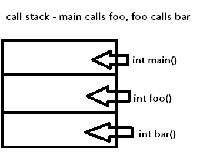
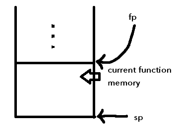

### Review from last lecture

The heap is slow because of *fragmentation* - data can be like this:

- A
- B
- C

Then, B is deleted, creating a "memory hole":

- A
- _
- C

This causes searching to take longer.

### Stack and functions



- The stack has an (artificially) limited size, imposed by the computer
- Exceeding this limit causes what is known as a "stack overflow"

Some code examples:

```c++
// huge static array
// if size is too big, could cause stack overflow
double nums[1000];

// dynamic array (NOT covered [prohibited in fact] in this class)
double nums[x]; // where x is defined earlier

// dynamically allocated array (the correct way to do it)
vector<double> nums[100000000];

// incorrect way to do it - static array would be too big
// and this would cause a stack overflow
double* nums = new double[100000000];
```

Another way to cause a stack overflow is with recursive functions:

- A recursive function is a function that calls itself
- If recursive functions go too deep into the stack, it will cause a stack overflow

Frames:

- The piece of a stack used by a function is the "frame" or "call frame"
- In addition to the sp (stack pointer) there may also be an fp (frame pointer) that points to the bottom of the frame (see diagram), depending on the architecture
  - In this class we ignore the frame pointer, even though MIPS has it. Just use stack pointer for simplicity



# Functions

- A *function* is a named piece of code that we can run ("call") from other places in code
- Once a function is done, execution returns to where the function was called
- Return address - the address of the **next** instruction after the function call
- **A function should always know its return address**

