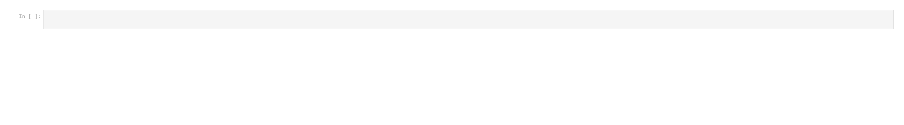
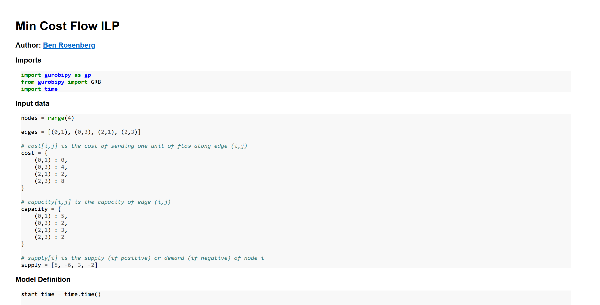

# Making Jupyter notebook conversion more efficient

Jupyter notebook conversion to HTML has always astounded me with how unwieldy its outputs are. The whole notebook is basically just a JSON, so how can the default HTML conversion result in such large files?

Here's an example of a blank notebook:


How large is the resulting HTML file? Let's use `du` (**d**isk **u**sage) to find out:

```{.bash .neutral}
$ du -sch blank.html
556K    blank.html
556K    total
```

What the hell is going on here? Let's have a look inside the file to find out.

Starting on line 63, we get the following:

```{.html .numberLines startFrom="63" .neutral}
<style type="text/css">
/*-----------------------------------------------------------------------------
| Copyright (c) Jupyter Development Team.
| Distributed under the terms of the Modified BSD License.
|----------------------------------------------------------------------------*/

/*
 * Mozilla scrollbar styling
 */

/*
 * Mozilla scrollbar styling
 */

/* use standard opaque scrollbars for most nodes */
[data-jp-theme-scrollbars='true'] {
  scrollbar-color: rgb(var(--jp-scrollbar-thumb-color))
    var(--jp-scrollbar-background-color);
}

/* for code nodes, use a transparent style of scrollbar. These selectors
 * will match lower in the tree, and so will override the above */
[data-jp-theme-scrollbars='true'] .CodeMirror-hscrollbar,
[data-jp-theme-scrollbars='true'] .CodeMirror-vscrollbar {
  scrollbar-color: rgba(var(--jp-scrollbar-thumb-color), 0.5) transparent;
}

/*
 * Webkit scrollbar styling
 */

/* use standard opaque scrollbars for most nodes */

[data-jp-theme-scrollbars='true'] ::-webkit-scrollbar,
[data-jp-theme-scrollbars='true'] ::-webkit-scrollbar-corner {
  background: var(--jp-scrollbar-background-color);
}

[data-jp-theme-scrollbars='true'] ::-webkit-scrollbar-thumb {
  background: rgb(var(--jp-scrollbar-thumb-color));
  border: var(--jp-scrollbar-thumb-margin) solid transparent;
  background-clip: content-box;
  border-radius: var(--jp-scrollbar-thumb-radius);
}

[data-jp-theme-scrollbars='true'] ::-webkit-scrollbar-track:horizontal {
  border-left: var(--jp-scrollbar-endpad) solid
    var(--jp-scrollbar-background-color);
  border-right: var(--jp-scrollbar-endpad) solid
    var(--jp-scrollbar-background-color);
}

[data-jp-theme-scrollbars='true'] ::-webkit-scrollbar-track:vertical {
  border-top: var(--jp-scrollbar-endpad) solid
    var(--jp-scrollbar-background-color);
  border-bottom: var(--jp-scrollbar-endpad) solid
    var(--jp-scrollbar-background-color);
}

...
```

This amalgamation of various CSS contingencies continues until line **13,800**. And then after that, there's even more CSS! 

Finally at line 14,219 we get to the MathJax JS snippet, and then at line 14,258 we finally get the entirety of our Jupyter notebook:

```{.html .numberLines startFrom="14258" .neutral}
<body class="jp-Notebook" data-jp-theme-light="true" data-jp-theme-name="JupyterLab Light">
<div class="jp-Cell jp-CodeCell jp-Notebook-cell jp-mod-noOutputs  ">
<div class="jp-Cell-inputWrapper">
<div class="jp-InputArea jp-Cell-inputArea">
<div class="jp-InputPrompt jp-InputArea-prompt">In&nbsp;[&nbsp;]:</div>
<div class="jp-CodeMirrorEditor jp-Editor jp-InputArea-editor" data-type="inline">
     <div class="CodeMirror cm-s-jupyter">
<div class=" highlight hl-ipython3"><pre><span></span> 
</pre></div>

     </div>
</div>
</div>
</div>

</div>
</body>
```

Obviously there's nothing there, because the notebook itself is blank. But wow, over 14,000 lines just for this result:



Clearly something is wrong here.

## The solution

I decided to fix this glaring issue with `nbconvert` by creating my own version, which you can see here: [gist link](https://gist.github.com/benrosenberg/66b02e9842b6082101d97e5cec344e05)

The script takes a couple parameters: the input filename, the output filename, and whether or not to create a "standalone" document - that is, one which includes *some* CSS and an HTML header, so that math can be rendered properly and the output looks nicer overall. I originally made this to embed Jupyter notebooks into another website, so having the option of using custom CSS instead was something I wanted.

Let's run my script and try `du` on it:

```{.bash .neutral}
$ du -sch blank_my_nbconv.html
8.0K    blank_my_nbconv.html
8.0K    total
```

This is a little more reasonable.

And the line count comparison:

```{.bash .neutral}
$ wc -l *.html
 14282 blank.html
   110 blank_my_nbconv.html
```

Here's what the HTML looks like (again, this is blank, but even though it is a bit more barebones it's basically the same idea):


For a better comparison, let's try both converters out on something a little more substantial. Here's a notebook ([gist link](https://gist.github.com/benrosenberg/1670ddd0e57ed01ecaa1ec00dca66a48)) in which I use the `gurobipy` Python module to solve an integer linear program for the Min Cost Flow problem, for a [video](https://www.youtube.com/watch?v=r9L6CQRxgy0) I made on the topic: 


Let's convert this with both methods and see how each looks. First, the default method:


Looks fine, but what about the filesize and linecount?

```{.bash .neutral}
$ wc -l MCF_ILP.html
14474 MCF_ILP.html

$ du -sch MCF_ILP.html
572K    MCF_ILP.html
572K    total
```

Pretty bad. And let's see how my converter fares:



I think this looks okay. And as for the sizes:

```{.bash .neutral}
$ wc -l MCF_ILP_my_nbconv.html
225 MCF_ILP_my_nbconv.html

$ du -sch MCF_ILP_my_nbconv.html
20K     MCF_ILP_my_nbconv.html
20K     total
```

Not horrible. 

So how does this work?

## How it works

Because, again, IPYNB files are just JSONs, it was simple and easy enough to just write a naive converter. Basically, for each type of cell/item (markdown, Python code, math, code output, or image), there's a separate function to wrap that element with a div containing the relevant class, which can be used in CSS as necessary. This is pretty simple for code, markdown, outputs, and images:

```{.python .neutral}
def wrap_code(code):
    wrapped = '<div class="wrapped-code">\n'
    wrapped += code
    wrapped += '\n</div>'
    return wrapped

def wrap_markdown(mkdn):
    wrapped = '<div class="wrapped-markdown">\n'
    wrapped += mkdn
    wrapped += '\n</div>'
    return wrapped

def wrap_output(code):
    wrapped = '<div class="wrapped-output"><pre>\n'
    wrapped += code
    wrapped += '\n</pre></div>'
    return wrapped

def wrap_image_output(imgsource):
    wrapped = ''
    return wrapped
```

It gets a bit more complicated for math, since we need to make sure the delimiters are treated correctly (and different types of delimiters are given different CSS classes), and we end up needing to use a simple regular expression:

```{.python .neutral}
def wrap_math(string):
    regex = r'(\${1,2})(?:(?!\1)[\s\S])*\1'
    matches = []
    last_end_index = 0
    for m in re.finditer(regex, string):
        delim = m.group(1)
        value = m.group(0)
        start = m.start()
        end   = m.end()
        before = string[last_end_index:start]
        last_end_index = end
        matches.append((before, delim, value))

    subbed = ''
    for (before, delim, value) in matches:
        subbed += before
        if delim == '$$':
            math_type = 'display'
        else:
            math_type = 'inline'
        tag_start = '<span class="math {}">'.format(math_type)
        tag_end = '</span>'
        subbed += tag_start + value.replace(delim, '') + tag_end

    if last_end_index == 0:
        last_end_index -= 1
    subbed += string[last_end_index+1:]
    return subbed
```

Other than that, we just need to parse out the cells from the JSON we're given, and apply these functions correctly. This includes the logic for organizing the images, syntax highlighting using the pygments lexer (the corresponding CSS for which is included in the standalone glob added when `-s` is passed), and markdown parsing using the `markdown` module:

```{.python .neutral}
out = ''

cells = json_rep['cells']
for cell in cells:
    cell_type, source, outputs = cell['cell_type'], cell['source'], None
    if 'outputs' in cell:
        if len(cell['outputs']) == 0:
            outputs = None
            text_outputs = None
            image_outputs = None
        else:
            text_outputs = None
            image_outputs = None
            outputs = cell['outputs']
            text_outputs = [output['text'] for output in outputs if 'text' in output]
            # base64 png images from (e.g.) matplotlib
            data_outputs = [output['data'] for output in outputs if output['output_type'] == 'display_data']
            img_data_outputs = [data_output for data_output in data_outputs if 'image/png' in data_output]
            if img_data_outputs:
                image_outputs = [img_data_output['image/png'] for img_data_output in img_data_outputs]
    joined_source = ''.join(source)
    if cell_type == 'markdown':
        out += wrap_markdown(markdown.markdown(wrap_math(joined_source), extensions=['tables']))
    else:
        out += wrap_code(highlight(joined_source, PythonLexer(), HtmlFormatter()))
    if 'outputs' in cell:
        if text_outputs:
            joined_text_outs = ''.join(text_outputs[0])
            out += wrap_output(joined_text_outs)
        if image_outputs:
            for image_output in image_outputs:
                out += wrap_output(wrap_image_output(image_output))

out = '<div class="wrapped-ipynb">' + out + '</div>'
```

And that's it, outside of the standalone HTML addition and naive argument parsing. 

Here's the complete list of imports:

```{.python .neutral}
import json
import markdown
from pygments import highlight
from pygments.lexers import PythonLexer
from pygments.formatters import HtmlFormatter
import re
import sys
```

I hope this is useful to at least one other person!